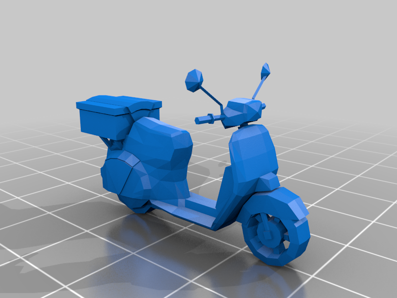

# Pizza Boy (Jonathan, Unax)
## Table of contents
- [Por que hemos elegido pizza boy](#por-que-hemos-elegido-pizza-boy)
  - [Boceto del modelo](#modelo)
  - [Caracteristicas](#altura-de-capa)
#### Por que hemos elegido Pizza boy
Hemos elegido este modelo de impresion ya que supone un reto suficientemente desafiante para imprimir. Tiene muchas angulos de inclinacion en partes como en sus retrovisores donde seria ideal usar funciones como soportes, capas adaptativas, etc. Lo que nos ayudaria como principiantes a entender correctamente todas estas funciones.
##### Modelo

##### Quality
layer height: 0.15mm

##### Walls
thickness: 0.8mm

##### Support
Support structure: Tree
Support hoverhang Angle: 60.0

###### Adapative layers: ON
Scale: 150%
Tiempo de impresion: 2h 39min
Cantidad de material: 8g - 1.04m

#### Caracteristicas
Usamos **0.15mm** de **quality (layer height)**, el cual es un buen intermedio entre calidad y velocidad.

Hemos añadido <b>adaptative layers</b>, para obtener un mejor acabado en zonas con inclinacion las cuales abundan en nuestra impresion.

Hemos añadido <b>soportes</b> porque sino partes como el retrovisor el cual tiene un tamaño muy pequeño podrian caer, entonces hemos visto adecuado usar esta ayuda.

- [El archivo STL](Pizzaboy_JonathanUnax.stl)
- [EL archivo UFP](Motillo_JonathanUnax.ufpi)