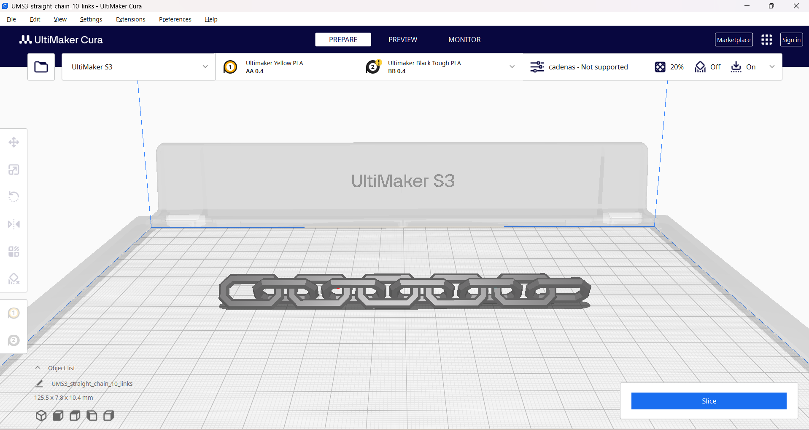
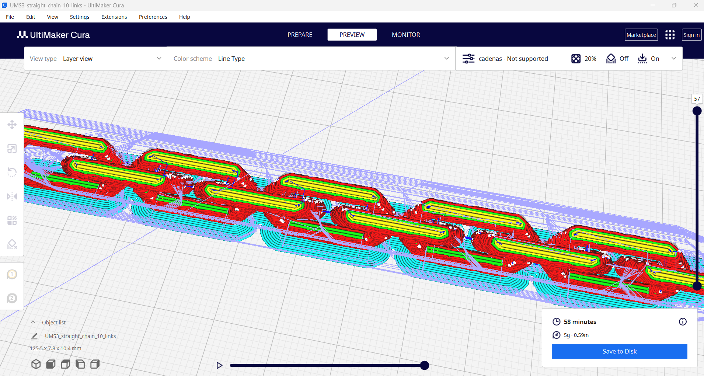
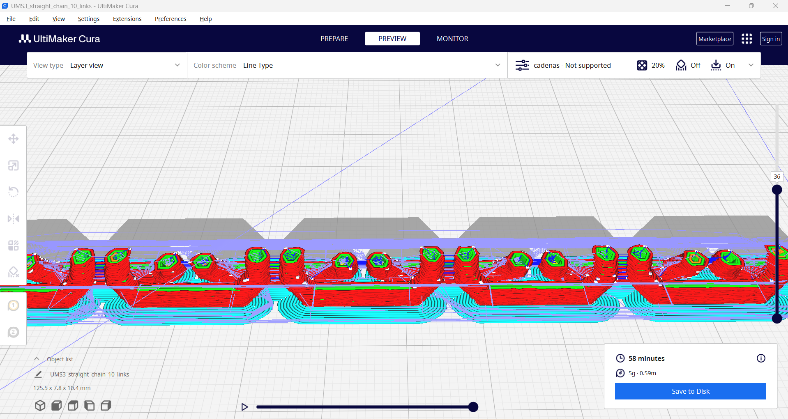
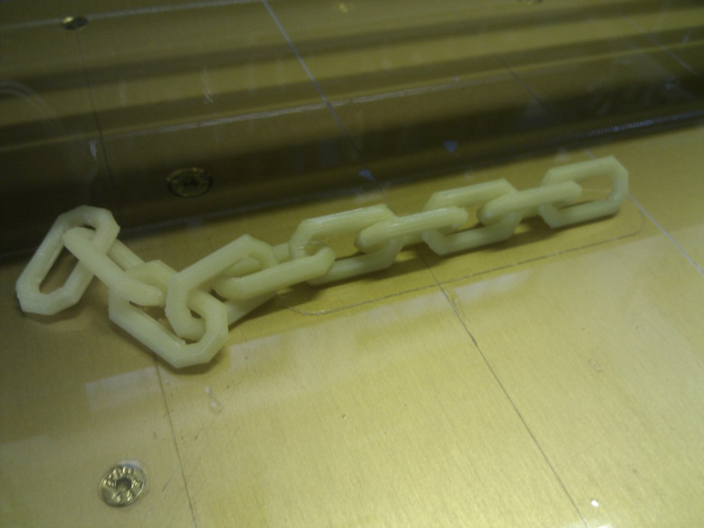

# Cadena (10 eslabones)

## Explicación del proyecto

Nosotros hemos elegido una cadena porque puede ser una estructura muy interesante para mostrar las capacidades de la impresión 3D, ya que genera la cadena completa sin tener que enlazar los eslabones manualmente.

El modelo concreto que hemos usado tiene diez eslabones y proviene de [thingiverse](https://www.thingiverse.com/thing:28405/files).

## Parámetros de impresión

Estos son los parámetros que hemos establecido para la impresión:

### Dimensiones del proyecto:
	-**X**: 125.5mm
	-**Y**: 7.75mm
	-**Z**: 10.392mm

### Parámetros de impresión:
	-**Calidad**:
		-Altura de capa: 0.15mm
	-**Paredes**:
		-Grosor: 0.8mm
		-Líneas de pared: 2
		-Expansión horizontal: -0.015mm
	-**Relleno**:
		-Densidad: 20.0%
		-Patrón de relleno: Cuadrícula
	-**Material**:
		-Temperatura de impresión: 215.0ºC
		-Temperatura de lámina: 60ºC
	-**Experimental**:
		-Superficie difusa: Sí
		-Grosor de superficie difusa: 0.15mm
		-Capas adaptivas: Sí

## Archivos del proyecto

[Archivo .stl](straight_chain_10_links.stl)

[Archivo .upf](impresion_cadena.ufp)

## Capturas de impresión

## Proyecto impreso

